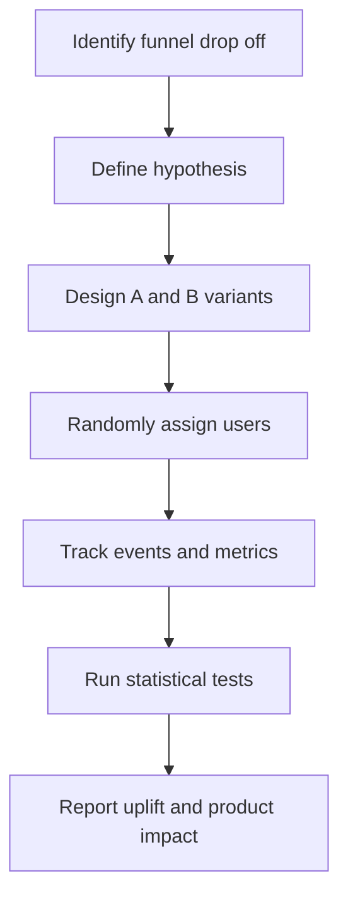

# A/B Testing – Activation Funnel Optimization (Correlate AI)

## Overview
This project analyzes a real-world A/B test on onboarding activation for an early-stage product. By simplifying CTA hierarchy and reducing visual clutter, the experiment produced a **+9% increase in activation rate**. I independently designed the experiment structure, analyzed event logs, and validated results using statistical testing.

## Research Questions
- Does simplifying the onboarding screen increase activation rate?
- Which behavioral metrics (completion rate, time on task, drop off) change between variants?
- How does CTA hierarchy influence user task completion behavior?

## Methods
- **Experiment type:** Randomized A/B test  
- **Sample size:** ~4,000 users  
- **Metrics:** Activation, completion, drop off, time on task  
- **Tools:** SQL, Python (pandas, scipy), internal event logs  
- **Statistical test:** Two proportion z test  

## 📊 Experiment Workflow

## Analysis
- Cleaned and aggregated event level logs  
- Segmented users by experiment bucket  
- Computed activation and completion rates and drop off positions  
- Performed two proportion z tests to validate uplift  
- Ran sensitivity checks for device type and traffic mix  
- Visualized funnel conversion steps for both variants  

## Key Findings
- Activation increased **+9%** in the simplified variant  
- Completion rate improved and early drop off decreased  
- Time on task decreased, suggesting lower cognitive load  
- Clearer CTA hierarchy led to more consistent user progress  

## Impact
This project demonstrates how UX focused A/B testing can:
- Improve onboarding efficiency  
- Reduce friction in early user journeys  
- Provide measurable evidence for UI simplification  
- Support data driven design decisions  
