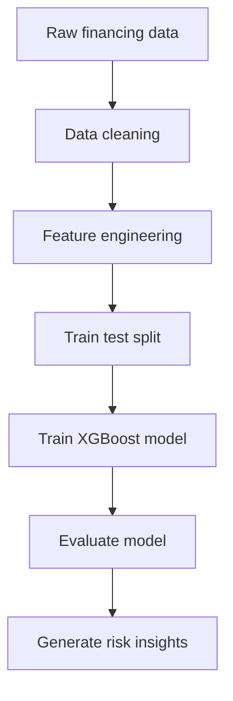

# Credit Risk Modeling – XGBoost Pipeline

## Overview
This project builds an end-to-end machine learning pipeline to predict device financing default risk. Using credit, payment, and device related features, the model identifies high risk applicants and provides insight into approval strategy. I handled data engineering, modeling, evaluation, and insight generation.

## Research Questions
- Can we accurately predict the probability of device financing default?  
- Which features most strongly influence default risk?  
- How can model predictions inform better approval decisions?

## Methods
- **Dataset size:** 6,000+ customer records  
- **Features:** FICO score, down payment, income ratio, device tier, installment behavior  
- **Model:** XGBoost classifier  
- **Evaluation:** ROC AUC, confusion matrix, precision and recall  
- **Tools:** Python (pandas, scikit learn, xgboost), matplotlib  

## 📊 Modeling Pipeline

## Analysis
- Preprocessed raw credit and payment data  
- Engineered device tier and income ratio features  
- Compared baseline models before selecting XGBoost  
- Tuned key hyperparameters for better performance  
- Interpreted feature importance rankings for business use  
- Evaluated trade offs between false positives and false negatives  

## Key Findings
- XGBoost achieved strong ROC AUC performance compared to baselines  
- FICO score, down payment, and device tier were top predictors  
- Low down payments were strongly associated with higher default rates  
- Model enabled more consistent and data informed risk assessments  

## Impact
This project shows how:
- Machine learning can improve credit decision policies  
- Risk modeling can reduce losses from high risk approvals  
- Model based insights can inform operational guidelines  
