# Credit Risk Modeling – XGBoost Pipeline (Course Project)

## Overview
This course project builds an end-to-end machine learning pipeline to predict **device financing default risk** using a structured dataset provided in the Verizon Case Study. The goal is to evaluate risk factors, improve approval consistency, and demonstrate practical ML modeling workflows.

I independently handled data cleaning, feature engineering, modeling, evaluation, and business insight generation.

## Dataset
- **Dataset type:** Course-provided Verizon device financing dataset  
- **Rows:** ~800–1,200 customer records (varies slightly by group)  
- **Features include:**  
  - FICO score  
  - Down payment amount  
  - Device cost / device tier  
  - Installment length  
  - Account tenure  
  - Income fields (cleaned + transformed)  
  - Target: **Default indicator (0/1)**  

## Research Questions
- Can we predict the probability of device financing default using credit & payment features?
- What are the strongest drivers of default risk?
- How can model outputs inform better in-store approval decisions?

## Methods
- **Models tested:** Logistic Regression → Random Forest → XGBoost  
- **Final model:** XGBoost classifier  
- **Evaluation metrics:** ROC-AUC, precision/recall, confusion matrix  
- **Tools:** Python (pandas, scikit-learn, xgboost, matplotlib)

---

## 📊 ML Pipeline

```mermaid
flowchart TD
    A[Raw course dataset<br/>Verizon Case Study] --> B[Data Cleaning<br/>Missing values · Outliers]
    B --> C[Feature Engineering<br/>Income ratios · Device tier]
    C --> D[Train/Test Split]
    D --> E[Model Training<br/>LogReg → RF → XGBoost]
    E --> F[Model Evaluation<br/>ROC · Precision · Recall]
    F --> G[Insights for Approval Strategy]
```

## Analysis
- Cleaned inconsistent income values and normalized device-related fields  
- Engineered features (e.g., income ratio, device price tier, payment ratio)  
- Compared multiple baseline models  
- Tuned XGBoost hyperparameters for improved performance  
- Interpreted feature importance for credit decision insights  
- Evaluated trade-offs between false positives (bad approvals) and false negatives (missed good customers)  

## Key Findings
- XGBoost outperformed all other models on ROC-AUC  
- FICO score and down payment amount were the strongest predictors  
- Lower down payments were strongly associated with higher default probability  
- Device tier and installment length captured additional risk patterns  
- Model enabled more consistent decision-making than heuristic/manual judgment  

## Impact
This project demonstrates how:
- ML models can support retail financing approval decisions  
- Data-driven risk assessment can reduce financial losses  
- Feature-level insights can inform down payment policies and approval thresholds  

> **Note:** This is a course project using synthetic or modified Verizon case data—no proprietary Verizon data was accessed.
