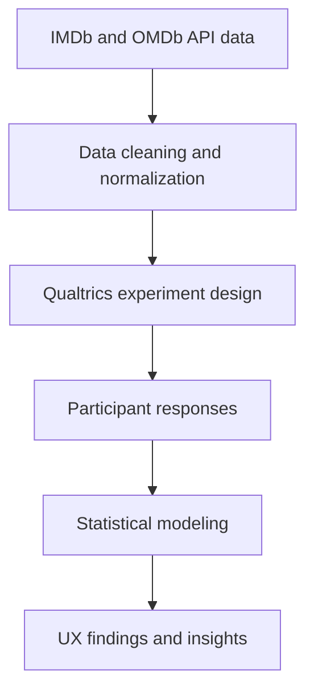

# UX Experiment – IMDb Judgment Study (Tsay Lab)

## Overview
This project investigates how people evaluate media quality when exposed to partial or biased information. The study combines IMDb/OMDb API metadata with an online behavioral experiment (N ≈ 120). I independently handled experiment design, data cleaning, and statistical modeling in R.

## Research Questions
- How do people judge the “quality” of movies when provided with incomplete metadata?
- Which factors (ratings, genre, popularity) influence perceived credibility?
- Do participants infer patterns or “rules” even when no real pattern exists?

## Methods
- **Data sources:** IMDb + OMDb API JSON  
- **Experiment platform:** Qualtrics survey (between-subjects randomization)  
- **Measures:** Perceived quality, confidence rating, viewing likelihood  
- **Tools:** R (tidyverse), ggplot2, statsmodels, correlation tests  

## 📊 Research Workflow

## Analysis
- Cleaned noisy API fields and normalized ratings  
- Ran Pearson and Spearman correlations  
- Performed regression models predicting judgments from metadata  
- Visualized distributions and interaction effects  
- Conducted exploratory factor analysis on perception items  

## Key Findings
- Users rely heavily on rating metrics even when warned about incompleteness  
- Genre stereotypes significantly affect perceived quality  
- Confidence does **not** track accuracy—participants overgeneralize missing cues  
- Regression model explains **42%** of variance in perceived quality ratings  

## Impact
This study demonstrates how users make decisions under uncertainty—insightful for:
- UX information architecture  
- Recommendation systems  
- Content ranking interfaces  
